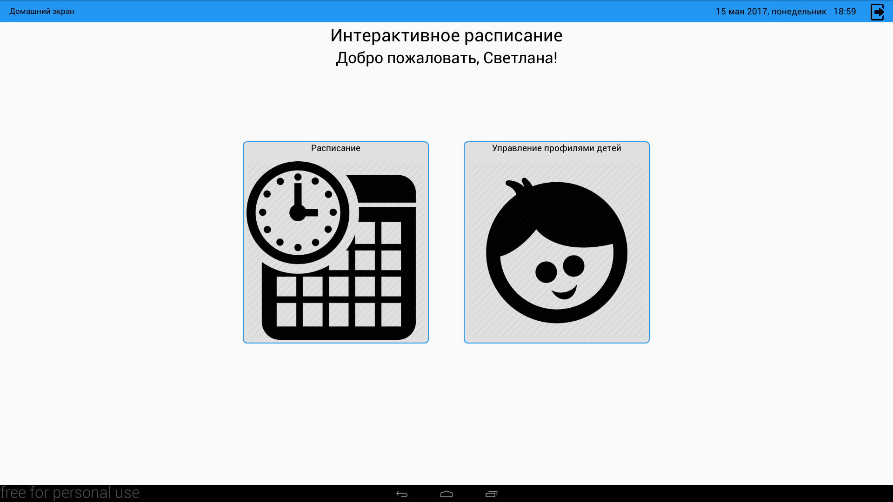
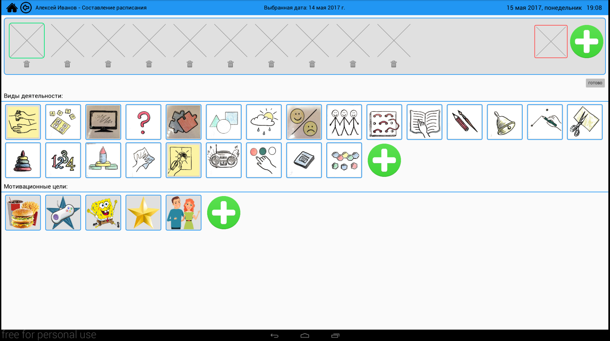
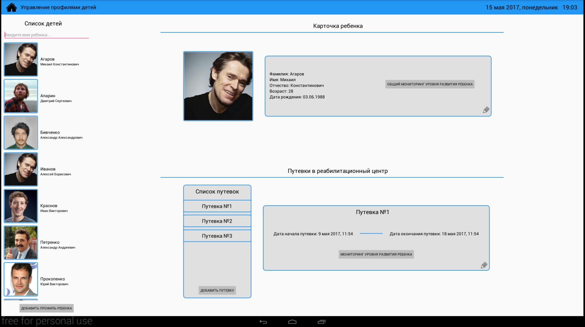
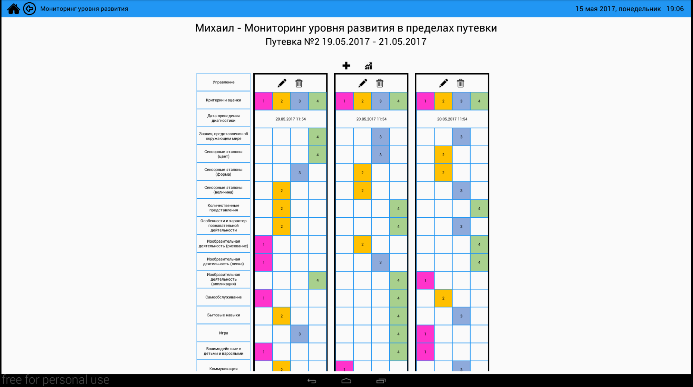

# Interactive Timetable - Интерактивное расписание для детей с расстройствами аутического спектра #

Проект был выполнен в качетве выпускной квалификационной работы Бакалавра в [Волгоградском Государственном Техническом Университете](http://www.vstu.ru/).  
  
Interactive Timetable - интерактивное расписание для детей с [расстройствами аутического спектра](https://ru.wikipedia.org/wiki/%D0%A0%D0%B0%D1%81%D1%81%D1%82%D1%80%D0%BE%D0%B9%D1%81%D1%82%D0%B2%D0%BE_%D0%B0%D1%83%D1%82%D0%B8%D1%81%D1%82%D0%B8%D1%87%D0%B5%D1%81%D0%BA%D0%BE%D0%B3%D0%BE_%D1%81%D0%BF%D0%B5%D0%BA%D1%82%D1%80%D0%B0) предназначено для составления и показа ежедневного расписания ребенка, а также ведения учета детей, их посещений реабилитационного центра и диагностик.  
  
Приложение разрабатывалось для целевого устройства - моноблока HP Slate 21 на базе операционной системы Android 4.2.2.  

### Что это и для кого? ###

* Приложение разрабатывалось для детей и педагогов [Волгоградского областного реабилитационного центра для детей-инвалидов «Надежда»](http://nadezhdavlz.ucoz.ru/).
* Приложение визуализирует ежедневное расписание детей, чтобы они могли постоянно видеть его и взаимодействовать с ним.
* Также приложение призвано помочь педагогам и психологам центра обрабатывать данные о детях: общие сведения, сведения о посещениях, данные результатов диагностик.

### Возможности ###
- Управление профилями детей.
- Управление посещениями.
- Управление диагностиками.
- Управление карточками расписания.
- Показ расписания для группы детей на заданный день.
- Составление индивидуального расписания для ребенка на заданный день.
- Взаимодействие с расписанием.
- Блокировка экрана расписания от случайных нажатий.
- Отображение текущей даты и времени.

### Скриншоты ###

### Видео-демо

### Хотите узнать больше?
Свяжитесь со мной: gafk555@gmail.com
